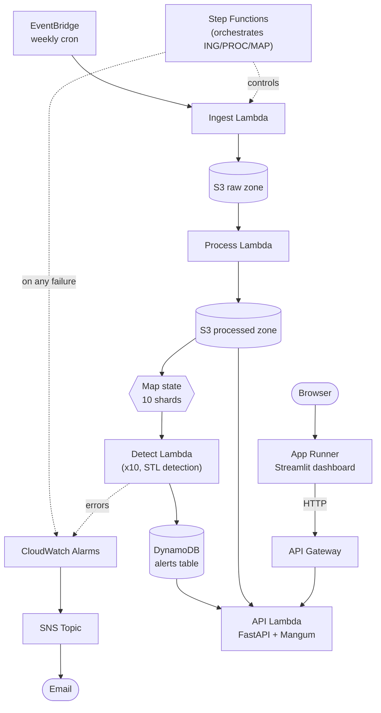

# Outbreak Sentinel

[](https://github.com/SHAH-MEER/OutbreakSentinel/actions/workflows/ci.yml)

Early-warning **anomaly detection** system for CDC-notifiable disease
surveillance data. Detects when current case counts look abnormal *right
now* — a different problem from forecasting what they'll be next.

## Status

Phase 5 (CI/CD, monitoring, docs) in progress.

- [x] Data source selected: CDC NNDSS Weekly Data (state-level, 139
      notifiable diseases, 2022–present) — see [data/README.md](data/README.md)
- [x] Ingestion script (`data/ingest_nndss.py`) pulls and cleans the full
      dataset from the CDC Socrata API
- [x] Backtest events identified: 2025 Texas measles outbreak (sharp
      point-source spike) and 2024 national pertussis resurgence (gradual
      surge) — see [data/README.md](data/README.md#identified-backtest-events-phase-1)
- [x] Found and fixed a real data bug along the way: CDC's NNDSS feed
      silently changed region-name casing convention at the 2024→2025
      boundary (`"TEXAS"` → `"Texas"`, same state), hitting 66 of 140
      region strings — every series spanning that boundary was being
      split in two by every downstream groupby. This also materially
      changed the detection benchmark below, not just the data pipeline.
- [x] Detection models implemented and benchmarked head-to-head: STL
      seasonal-decomposition baseline vs. changepoint detection
      (`ruptures`) — **STL ships as primary** (78.6%/64.9% recall,
      1-week detection latency on both the tuning and held-out event).
      This reverses an earlier conclusion in this project: the casing
      bug above had been truncating backtest series short enough that
      STL couldn't run real seasonal decomposition and looked
      structurally worse than it actually is. See
      [detection/README.md](detection/README.md) for the full writeup —
      both this reversal and a separate real bug in the changepoint
      method (`ruptures.Pelt`'s `jump=5` default) are documented there.
- [x] Found and fixed a severity-scale bug while building the production
      driver: a near-constant rare-disease series could produce a
      severity score in the hundreds of billions (dividing by
      floating-point noise). Fixed with an unconditional floor on the
      scale, not an ever-shrinking epsilon check — see
      [detection/README.md](detection/README.md#fixed-bug-severity-blowup-on-near-constant-sparse-series).
      Caught before Phase 4 built a dashboard on top of it.
- [x] Production detection driver (`detection/run_detection.py`) — scores
      the latest week across every (region, disease) series, separate
      from the historical backtest script. Parallelized and shardable:
      benchmarking showed scoring the full panel (~10.2k series, post
      casing-fix) needs more than one Lambda invocation's worth of
      headroom under the 900s timeout, so it's split across parallel
      invocations by a stable hash partition rather than run in one
- [x] AWS pipeline authored in Terraform: EventBridge (weekly cron) ->
      Step Functions (ingest -> process -> detect Lambdas, container
      images, detect fanned out via a Map state) -> S3 (raw + processed)
      -> DynamoDB alerts table -> CloudWatch alarms on failures.
      `terraform validate` passes; **not yet deployed** (deploying
      creates real, billable AWS resources — see
      [infra/README.md](infra/README.md) before running `apply`)
- [x] API (`api/main.py`, FastAPI + Mangum) serving current alerts
      (`/alerts`) and per-series history with the anomaly overlay
      (`/series`) — DynamoDB/S3 in production, a local-dev fallback that
      computes alerts on the fly otherwise (see
      [infra/README.md](infra/README.md#local-development-no-aws-needed)).
      API Gateway (HTTP API) + Lambda authored in Terraform, with its own
      least-privilege (read-only) IAM role.
- [x] Dashboard (`dashboard/app.py`, Streamlit) — live US choropleth
      colored by peak severity, click a state (or use the dropdowns) to
      see its time series with flagged anomalies overlaid, and a
      sortable alert feed table. Only talks to the API over HTTP, never
      to AWS directly. Verified rendering and the map-click interaction
      end-to-end in a real browser (Playwright) before calling this
      done — see the screenshot check in this phase's session. App
      Runner authored in Terraform (its own container image, since it's
      a long-running server, not a Lambda) — **not yet deployed**, and
      unlike the rest of this stack, App Runner bills for always-on
      compute, so see the cost note in
      [infra/README.md](infra/README.md#cost-note) before applying.
- [x] CI/CD: `ci.yml` (pytest + `terraform validate` on every push) plus
      a separate `deploy.yml` that applies this Terraform config after
      CI passes on `main` — authored and OIDC-based (no long-lived AWS
      keys), but inert until real one-time setup is done (remote
      Terraform state, an IAM role, repo secrets — see
      [infra/README.md](infra/README.md#cicd-prerequisites-one-time-manual--for-githubworkflowsdeployyml)).
- [x] Monitoring: pipeline/Lambda failure alarms now actually notify
      (SNS topic + optional email subscription — previously they fired
      but had nowhere to page)
- [x] Architecture diagram (below) and an API latency/cost note with
      real measured local numbers, not just estimates

## Architecture



## Repo structure

```text
outbreak-sentinel/
├── data/       # ingestion scripts
├── detection/  # model + backtesting
├── api/        # FastAPI/Lambda handler
├── dashboard/  # Streamlit app
├── infra/      # Terraform
├── tests/
└── .github/workflows/
```

## Local setup

```bash
pip install -r requirements.txt
python data/ingest_nndss.py   # pulls raw data -> data/raw/
python data/eda.py            # builds tidy panel -> data/processed/
pytest tests/

# API + dashboard (no AWS needed — see infra/README.md)
uvicorn api.main:app --reload --port 8010
API_BASE_URL=http://127.0.0.1:8010 streamlit run dashboard/app.py
```

## API latency & cost

Nothing is deployed yet (see Status above), so there's no real AWS
measurement to report — but local dev numbers are real, measured `curl`
timings against the running FastAPI app, not estimates:

| Endpoint | Local latency (measured) | What it's doing |
| --- | --- | --- |
| `/health` | ~4-5ms | No computation |
| `/alerts` | ~4-27ms | Reads the in-memory cached alert list |
| `/series` | ~320-360ms | Runs STL detection fresh on one 244-week series, every request — not cached |

`/series` is the one worth watching in production: it's real CPU work
per request (the same `stl_baseline.detect` call used everywhere else in
this project), not a cache hit. On Lambda, expect that plus container
cold-start overhead — pandas/numpy/statsmodels imports are heavy enough
that a cold container-image Lambda commonly adds 1-3s on top of the
compute time above; a warm one shouldn't add much. Reasoning through
AWS's published per-request pricing at 1024MB memory (`infra/api.tf`):
a ~350ms `/series` invocation costs roughly $0.0000058 in Lambda compute
plus $0.0000002 per API Gateway request — under a dollar a month even at
100k requests. `/alerts` is cheaper still once DynamoDB replaces the
local dev cache.

**Known scaling caveat, not yet hit**: `get_alerts()` (`api/data.py`)
does a full `dynamodb:Scan` in production — fine at the current alert
volume (hundreds of rows), but a Scan's cost and latency grow with
*table size*, not just result size. Worth revisiting (a GSI on a
constant partition key, or a small "current week" pointer item) if this
ever needs to serve real traffic at a larger scale than a portfolio demo.
